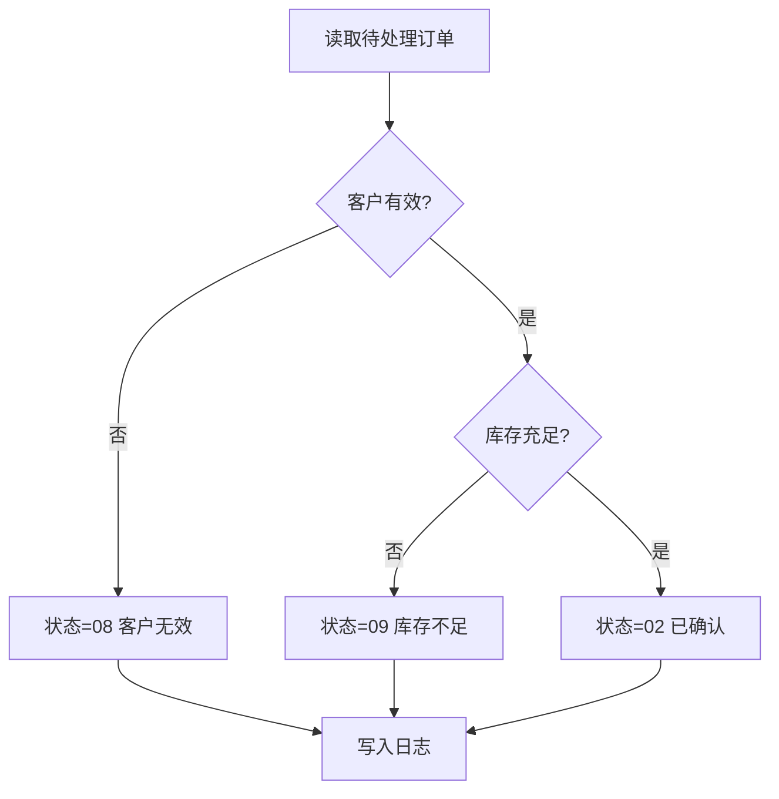

# 软件设计说明书 (SDD)

## 1. 文档信息
- 程序名: ORDPRC
- 版本: 1.0
- 作者: AS400 SDD Framework
- 日期: {DATE}

## 2. 变更记录
| 版本 | 日期 | 变更人 | 说明 |
| --- | --- | --- | --- |
| 1.0 | {DATE} | AS400 SDD Framework | 初始版本 |

## 3. 功能概述
ORDPRC 负责读取待处理订单并完成客户、库存、状态、日志闭环。

## 4. 系统环境
- 平台: IBM i / AS400
- 语言: RPGLE (free-format), CL
- 数据源: PF/LF

## 5. 文件定义 (PF/LF/DDL)
- ORDPF
- CUSTMF
- INVPF
- ORDLOGPF

## 6. 程序规格
### 6.1 处理流程
- 1. 读取 ORDPF 订单文件中的待处理订单（状态 = 01）
- 2. 验证客户信息（查询 CUSTMF 客户主文件）
- 3. 验证库存（查询 INVPF 库存文件，检查数量是否充足）
- 4. 更新订单状态：
- 5. 记录处理日志到 ORDLOGPF

### 6.2 输入输出参数
- 输入: ORDPF, CUSTMF, INVPF
- 输出: ORDPF(更新状态), ORDLOGPF(写入日志)

### 6.3 业务规则
- 状态 01 表示待处理订单。
- 状态 02 表示订单已确认。
- 状态 08 表示客户无效。
- 状态 09 表示库存不足。

### 6.4 错误处理
- 文件打开失败: 记录日志并退出
- 链接记录失败: 根据业务规则返回状态
- 未处理异常: monitor/on-error 捕获并记录

## 7. 测试策略
- 正常流程 (状态=02)
- 客户无效 (状态=08)
- 库存不足 (状态=09)
- 日志写入验证

## 8. 部署说明
- 编译 RPGLE/CL
- 在测试库执行
- 验证日志与状态更新

## 9. 待澄清问题
- ORDLOGPF 的字段结构需要在落地时与现有 DDS 定义核对。
